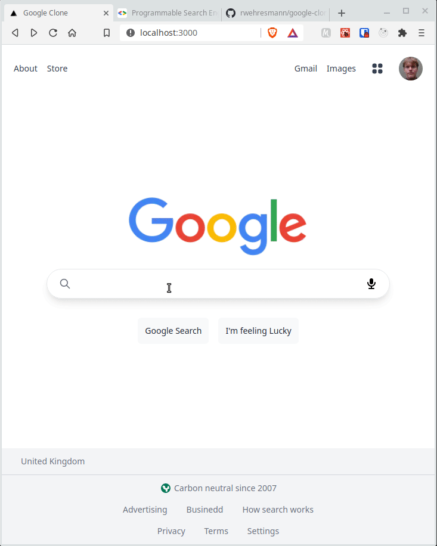

# Google Clone

  

Google clone is a limited implementation of Google search page. It uses the [Google Programmable Search Engine API](https://developers.google.com/custom-search) to perform a search like Google does.

Tools used in the development:

  * Nextjs;
  * [Tailwindcss](https://tailwindcss.com/)

This project has study purposes only, and it was developed mainly to experience how to build responsive web pages with Tailwindcss.

## How to run this app?

In the project folder:

  * Run `npm install`;
  * Create your `.env` based on `.env.example`, and fill it with your Google API settings;
  * Run `npm run dev`.
